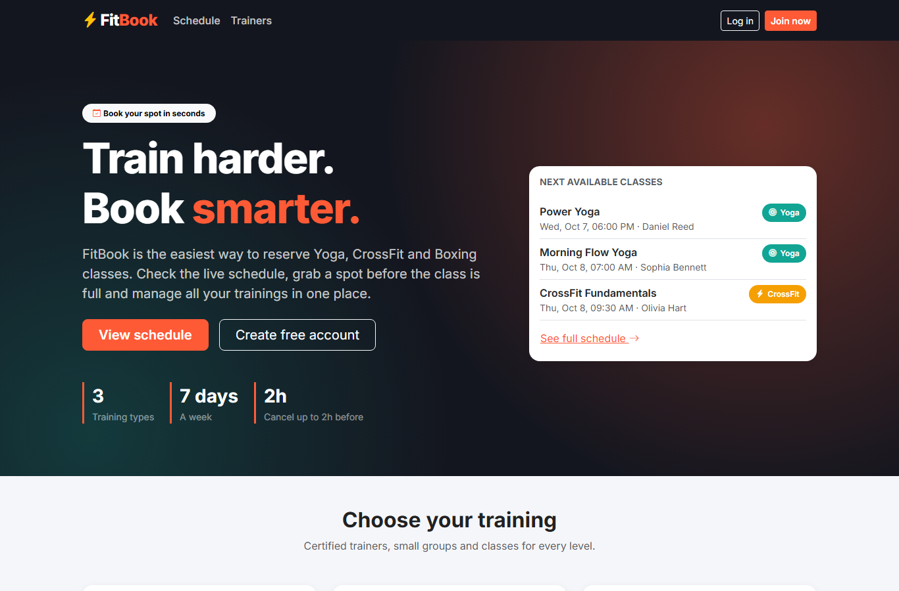
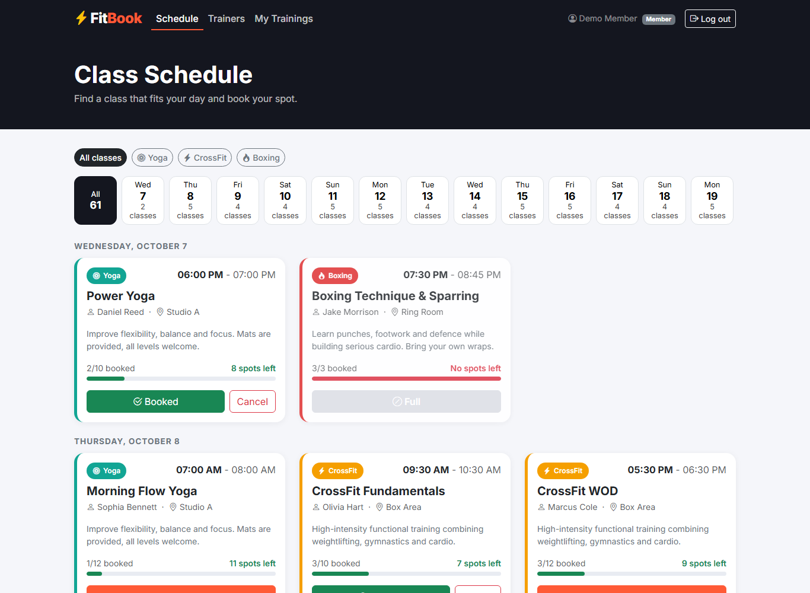
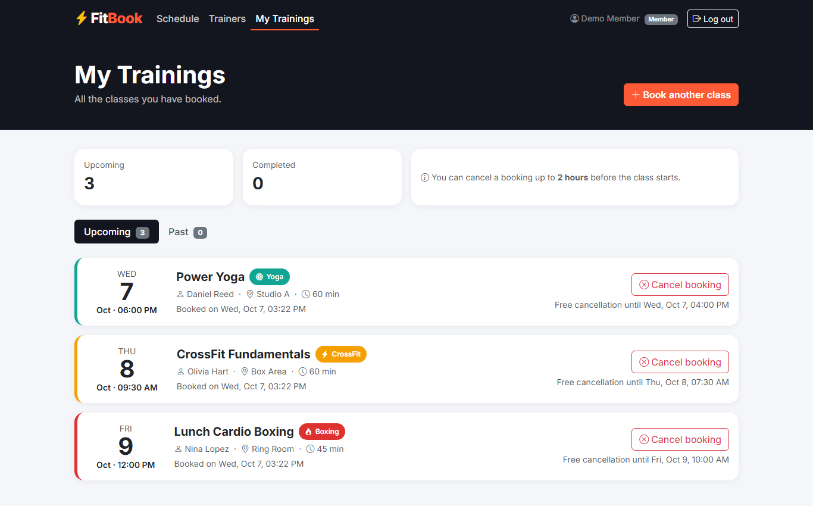
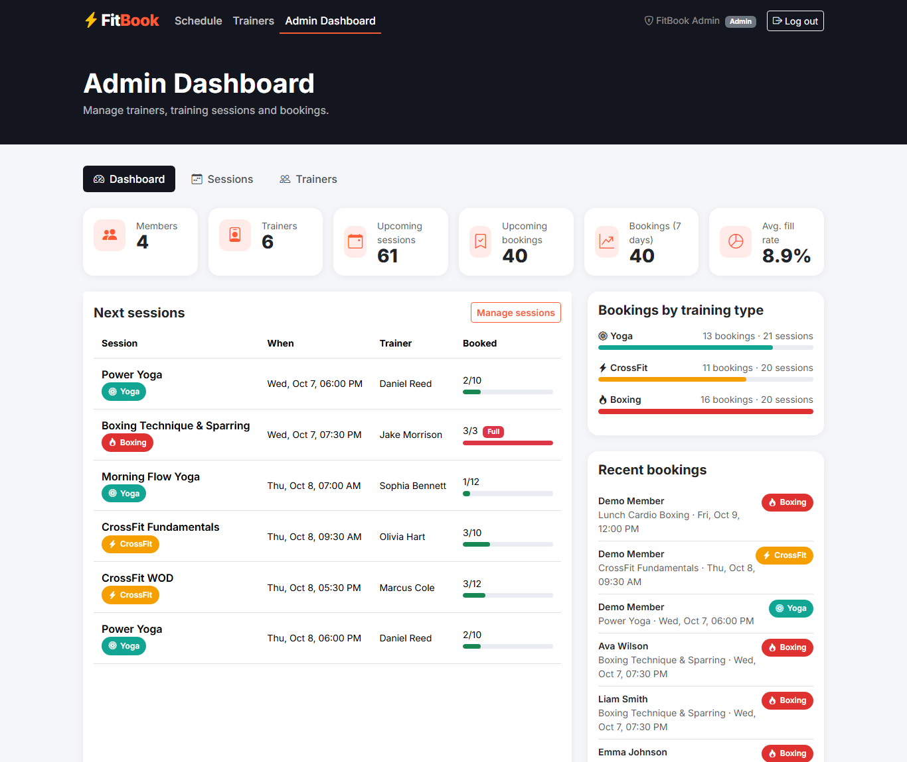
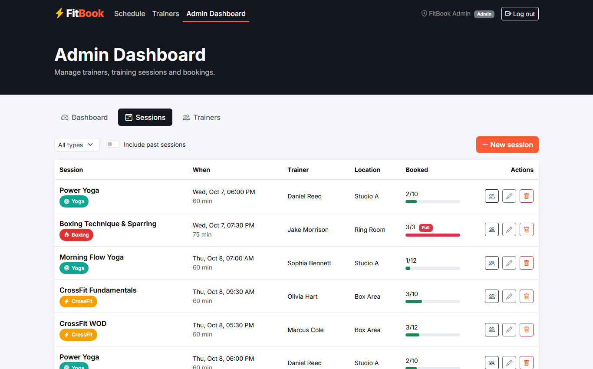

# FitBook - Gym Class Booking App

FitBook is a full-stack web application for booking group fitness classes. Members can browse the weekly schedule, book **Yoga**, **CrossFit** and **Boxing** sessions, cancel bookings and see all their trainings in one place. Admins manage trainers and training sessions and follow everything from a dashboard.



## Features

### Member
- Sign up and log in (JWT authentication)
- Browse the schedule and filter it by **day** and **training type**
- See live availability for every session (`7/10 booked`, progress bar)
- Book a session with one click. The **Book** button turns into a disabled **Full** button when no spots are left
- Cancel a booking up to **2 hours** before the session starts
- **My Trainings** page with upcoming and past bookings

### Admin
- **Admin Dashboard** with key numbers: members, trainers, upcoming sessions, bookings, bookings in the last 7 days, average fill rate, bookings per training type, next sessions and recent bookings
- Add, edit and delete **trainers**
- Add, edit and delete **training sessions** (Yoga, CrossFit, Boxing)
- See the **participants** of every session

### Business rules (enforced by the API)
| Rule | Response |
| --- | --- |
| A session cannot be booked when it is full | `409 Conflict` |
| A member cannot book the same session twice (unique DB index + check) | `409 Conflict` |
| Sessions that already started cannot be booked or cancelled | `400 Bad Request` |
| A booking can only be cancelled up to 2 hours before the start | `400 Bad Request` |
| A trainer can only lead sessions of their specialty | `400 Bad Request` |
| A trainer cannot have two overlapping sessions | `409 Conflict` |
| Session capacity cannot be lowered below the current number of bookings | `400 Bad Request` |
| A trainer with sessions cannot be deleted | `409 Conflict` |
| Public registration always creates a **Member**. The **Admin** account is seeded | - |

Bookings are created inside a serializable transaction, so two members cannot take the last spot at the same time.

## Tech Stack

| Layer | Technologies |
| --- | --- |
| Backend | ASP.NET Core Web API (.NET 10), Entity Framework Core 10, SQL Server (LocalDB), JWT Bearer authentication, Swagger |
| Frontend | React 19, Vite, React Router, Axios, Bootstrap 5, Bootstrap Icons |
| Tests | xUnit, EF Core SQLite in-memory provider |

## Screenshots

| Schedule | My Trainings |
| --- | --- |
|  |  |

| Admin Dashboard | Manage Sessions |
| --- | --- |
|  |  |

## Project Structure

```
FitBook/
├── backend/
│   ├── FitBook.slnx
│   ├── dotnet-tools.json            # local dotnet-ef tool
│   ├── FitBook.Api/
│   │   ├── Controllers/             # Auth, Trainers, Sessions, Bookings, Dashboard
│   │   ├── Data/                    # AppDbContext, DbSeeder, Migrations
│   │   ├── Dtos/                    # Request / response models
│   │   ├── Exceptions/              # Business exceptions (404, 400, 409, 401)
│   │   ├── Extensions/              # ClaimsPrincipal helpers
│   │   ├── Middleware/              # Global exception handler (ProblemDetails)
│   │   ├── Models/                  # User, Trainer, TrainingSession, Booking
│   │   ├── Options/                 # JWT settings
│   │   ├── Services/                # Business logic + interfaces
│   │   ├── appsettings.json
│   │   └── appsettings.Development.example.json
│   └── FitBook.Tests/               # xUnit tests
├── frontend/
│   ├── src/
│   │   ├── api/                     # Axios instance + API calls
│   │   ├── components/              # NavBar, SessionCard, ProtectedRoute, shared UI
│   │   ├── context/                 # AuthContext, ToastContext
│   │   ├── pages/                   # Home, Login, Register, Schedule, My Trainings, Trainers
│   │   │   └── admin/               # Dashboard, Sessions, Trainers
│   │   └── utils/                   # Formatting & helpers
│   └── .env.example
└── docs/screenshots/
```

## Getting Started

### Prerequisites
- [.NET 10 SDK](https://dotnet.microsoft.com/download)
- [Node.js 20+](https://nodejs.org/)
- SQL Server or **SQL Server Express LocalDB** (installed with Visual Studio)

### 1. Clone the repository

```bash
git clone https://github.com/<your-username>/FitBook.git
cd FitBook
```

### 2. Configure and run the API

Secrets are not stored in the repository. Create your local settings file from the example:

```bash
cd backend/FitBook.Api
cp appsettings.Development.example.json appsettings.Development.json
```

Open `appsettings.Development.json` and set `Jwt:Key` to any random string with **at least 32 characters**. Change the connection string if you don't use LocalDB.

```bash
cd ..                      # backend folder
dotnet tool restore        # installs dotnet-ef locally
dotnet run --project FitBook.Api
```

On start the API **applies the migrations automatically** and, in the Development environment, seeds demo data (trainers, two weeks of sessions and a few bookings).

- API: `http://localhost:5080`
- Swagger UI: `http://localhost:5080/swagger`

### 3. Run the frontend

```bash
cd frontend
cp .env.example .env
npm install
npm run dev
```

Open `http://localhost:5173`.

### Demo accounts

| Role | Email | Password |
| --- | --- | --- |
| Admin | `admin@fitbook.com` | `Admin123!` |
| Member | `member@fitbook.com` | `Member123!` |

Passwords come from the `Seed` section of `appsettings.Development.json`.

## Running Tests

```bash
cd backend
dotnet test
```

The tests use an in-memory **SQLite** database, so unique indexes, foreign keys and transactions behave like in a real database. They cover:

- **BookingService**: booking, full sessions, double booking, past sessions, cancellation window, ownership of bookings
- **TrainingSessionService**: validation, trainer specialty, overlapping sessions, capacity, availability flags
- **AuthService**: registration, duplicate emails, login with valid and invalid credentials
- **TrainerService**: create, filter, delete rules
- **BookingRules**: the 2-hour cancellation window

## API Endpoints

| Method | Endpoint | Access | Description |
| --- | --- | --- | --- |
| POST | `/api/auth/register` | Public | Create a member account |
| POST | `/api/auth/login` | Public | Log in and get a JWT |
| GET | `/api/auth/me` | Logged in | Current user |
| GET | `/api/trainers?specialty=` | Public | List trainers |
| GET | `/api/trainers/{id}` | Public | Trainer details |
| POST / PUT / DELETE | `/api/trainers/{id?}` | Admin | Manage trainers |
| GET | `/api/sessions?type=&trainerId=&from=&to=&upcomingOnly=` | Public | Schedule (includes `myBookingId` for members) |
| GET | `/api/sessions/{id}` | Public | Session details |
| POST / PUT / DELETE | `/api/sessions/{id?}` | Admin | Manage sessions |
| GET | `/api/sessions/{id}/participants` | Admin | Members who booked a session |
| GET | `/api/bookings/my` | Member | My Trainings |
| POST | `/api/bookings` | Member | Book a session `{ "sessionId": 1 }` |
| DELETE | `/api/bookings/{id}` | Member | Cancel a booking |
| GET | `/api/admin/dashboard` | Admin | Dashboard statistics |

Errors are returned as [ProblemDetails](https://datatracker.ietf.org/doc/html/rfc9457), for example:

```json
{ "title": "Conflict", "status": 409, "detail": "This session is full." }
```

## Possible Improvements
- Waiting list when a session is full
- Email reminders before a session
- Recurring sessions (create a weekly series at once)
- Refresh tokens
- Docker Compose setup for API, database and frontend
